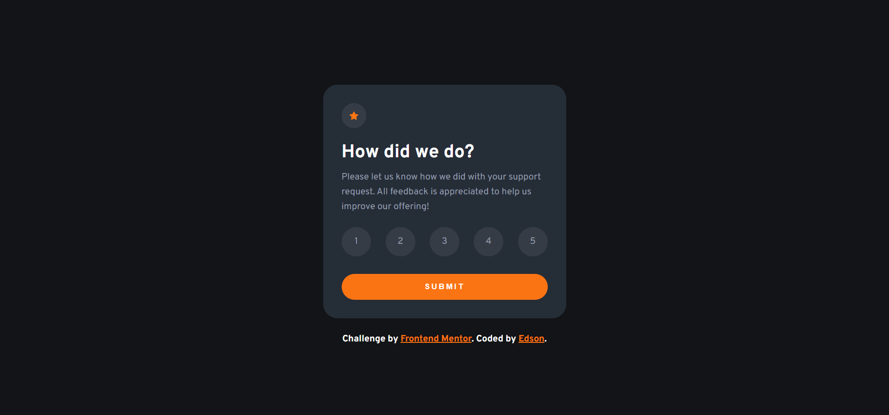

# ✨ Frontend Mentor - Interactive rating component solution ✨

Esta é uma solução para o [Interactive rating component challenge on Frontend Mentor](https://www.frontendmentor.io/challenges/interactive-rating-component-koxpeBUmI). Os desafios do Frontend Mentor ajudam-no a melhorar as suas capacidades de codificação através da construção de projectos realistas.

### 🧾 Sobre

Os utilizadores devem ser capazes de:

-   Ver a disposição ideal para a aplicação dependendo do tamanho do ecrã do seu dispositivo
-   Ver os estados de hover para todos os elementos interactivos na página
-   Seleccionar e submeter uma classificação numérica
-   Ver o estado do cartão "Obrigado" após submeter uma avaliação

### Screenshot



### 🚀 Tecnologias utilizadas

-   Semantic HTML5 markup
-   CSS custom properties
-   BEM methodology
-   Flexbox
-   Desktop-first workflow

### 📖 O que eu aprendi

Durante o desenvolvimento desse projeto, aprendi a usar o forEach no Javascript com o propósito de percorrer os elementos, não retornando nada (Valor indefinido).

```js
const exampleArray = [1, 2, 3, 4, 5];

console.log(exampleArray.forEach((value) => value * value));
// Output: (undefined)
```

### 👨‍💻 Desenvolvimento contínuo

Pretendo utilizar a metologia BEM, pois facilita a leitura do código HTML e CSS. Além disso, evita que aconteça conflitos de estilos.

### 🤝 Recursos úteis

-   [forEach 1](https://developer.mozilla.org/en-US/docs/Web/JavaScript/Reference/Global_Objects/Array/forEach) e [forEach 2](https://www.w3schools.com/jsref/jsref_foreach.asp) - Entendendo melhor o forEach
-   [BEM](https://en.bem.info/methodology/quick-start/) - Isso me ajudou a deixar o CSS fácil de ler. Gostei muito deste modelo e vou usá-lo daqui para frente.

### 〽️ Getting started

```zsh
    # Clonando o repositório em sua máquina
    $ git clone https://github.com/edsonjaguiar/Interactive-rating-component
```
